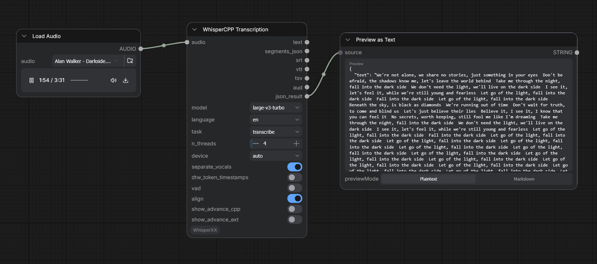
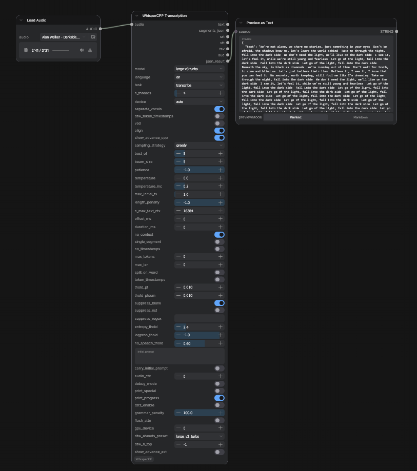
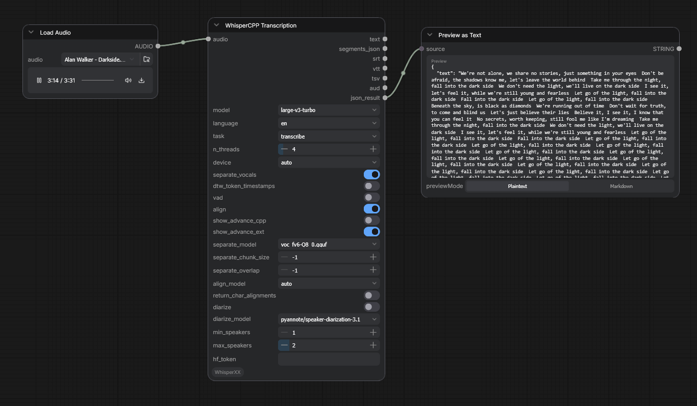

# ComfyUI-WhisperCPP

ComfyUI custom node for speech-to-text using **whisper.cpp** (C API via ctypes).  
Full pipeline: ASR → Vocal Separation → Alignment → Diarization — **zero whisperx**.

## Screenshots





## Features

- **whisper.cpp native** — DLL + ctypes binding directly to C API, no Python wrapper
- **All `whisper_full_params`** — every parameter exposed as a node widget
- **Two advance toggles** — `show_advance_cpp` (core whisper params) + `show_advance_ext` (UVR/alignment/diarization detail)
- **7 output sockets** — text, segments_json, srt, vtt, tsv, aud, json_result (no file I/O)
- **GPU acceleration** — Vulkan, OpenCL, CUDA, Metal (build-time auto-detect)
- **VAD** — cpp-annote (community-1 segmentation model, DLL + onnxruntime)
- **UVR vocal separation** — BSRoformer.cpp DLL (GGUF model, no temp files)
- **Pre-filter** — RMS-based energy filter to prevent hallucinations on silence
- **Alignment** — sherpa-onnx CTC (zipformer, word-level timestamps)
- **Diarization** — cpp-annote DLL (no Python dependencies)
- **Cross-platform** — Windows/MSVC, Linux/GCC, macOS/Clang (DLL/so/dylib)

## Modules

| Module | Language | Binding | File |
|---|---|---|---|
| **whisper.cpp** (ASR) | C API | `whisper_lib.py` | `whisper.dll` (1.3 MB) |
| **BSRoformer.cpp** (UVR) | C API | `bs_roformer_lib.py` | `bs_roformer.dll` + ggml DLLs |
| **cpp-annote** (VAD/Diarization) | C API | `cpp_annote_lib.py` | `cpp_annote.dll` + onnxruntime.dll |

All modules follow the same pattern: **C API header → shared library → ctypes binding**.

## Pipeline

```
Audio Input
  │
  ├─ [UVR] BSRoformer.dll → vocal separation (optional)
  │    16kHz → Resample(44100) → DLL → mono → Resample(16000)
  │
  ├─ [Pre-filter] RMS energy → speech detection (optional)
  │    Only transcribe sections with audio energy > threshold
  │
  ├─ [VAD] cpp-annote.dll → speech segmentation (optional)
  │
  ├─ whisper.dll → transcribe (per-segment if VAD/pre-filter on)
  │
  ├─ [Alignment] sherpa-onnx CTC → word timestamps (default ON)
  │
  └─ [Diarization] cpp-annote DLL → speaker labels (optional)
       │
       └─ 7 output sockets
```

## Installation

```bash
cd ComfyUI/custom_nodes/
git clone --recurse-submodules https://github.com/obvirm/ComfyUI-WhisperCPP
cd ComfyUI-WhisperCPP
pip install -r requirements.txt
```

### Build

```bash
# whisper.cpp — auto-detect GPU backends
python build_whisper_cpp.py

# BSRoformer DLL
python build_bs_roformer.py

# cpp-annote DLL
build_cpp_annote_dll.bat          # Windows
python build_cpp_annote.py        # TODO: cross-platform
```

### Build Options (whisper.cpp)

```bash
# Auto-detect GPU (default)
python build_whisper_cpp.py

# Force specific backend
python build_whisper_cpp.py --gpu vulkan
python build_whisper_cpp.py --gpu cuda
python build_whisper_cpp.py --gpu cpu  # CPU only
```

## GPU Backends

| Backend | Windows | Linux | macOS |
|---------|---------|-------|-------|
| Vulkan  | ✅      | ✅    | ✅    |
| OpenCL  | ✅      | ✅    | -     |
| CUDA    | ✅*     | ✅    | -     |
| Metal   | -       | -     | ✅    |

*CUDA requires compatible CMake + Visual Studio integration + CUDA Toolkit.

## Usage

1. Add **WhisperCPPNode**
2. Connect audio source to `audio` socket
3. Select model (auto-downloads on first use)
4. Set `language` (or None for auto-detect)
5. Enable `hallu_filter` (default ON) for RMS-based pre-filter to prevent hallucinations
6. Set `vad=true` for active speech detection (cpp-annote segmentation)
7. Set `separate_vocals=true` for vocal separation (BSRoformer)
8. Enable `show_advance_cpp` / `show_advance_ext` for full parameter access

### Output Sockets

| Socket | Format | Content |
|---|---|---|
| `text` | STRING | Full transcript |
| `segments_json` | STRING (JSON) | Segments with timestamps |
| `srt` | STRING | SubRip subtitle |
| `vtt` | STRING | WebVTT subtitle |
| `tsv` | STRING | Tab-separated values |
| `aud` | STRING | Speaker-labeled transcript |
| `json_result` | STRING (JSON) | Full result metadata |

## Models

| Model | Location | Size |
|---|---|---|
| Whisper GGML | `ComfyUI/models/whispercpp/` | 1.6 GB (large-v3-turbo) |
| UVR GGUF | `ComfyUI/models/uvr/` | 251 MB |
| Alignment CTC | `ComfyUI/models/alignment/sherpa/` | 383 MB |
| cpp-annote ONNX | `cpp-annote/artifacts/` | 32 MB (in repo) |

## Architecture

```
ComfyUI-WhisperCPP/
├── __init__.py                 # Register node
├── whispercpp_node.py          # Class WhisperCPPNode
├── js/whispercpp_node.js       # Frontend toggle (advance sections)
│
├── whispercpp/
│   ├── whisper_lib.py          # ctypes → whisper.dll
│   ├── bs_roformer_lib.py     # ctypes → bs_roformer.dll
│   ├── model.py                # Model download manager
│   ├── audio.py                # Audio processor
│   └── ext/
│       ├── uvr.py              # Vocal separation (BSRoformer DLL)
│       ├── alignment_sherpa.py  # CTC alignment
│       ├── cpp_annote_lib.py   # ctypes → cpp_annote.dll
│       └── cppannote.py        # VAD + diarization wrapper
│
├── whisper.cpp/                # git submodule
├── bs_roformer.cpp/            # git submodule
├── cpp-annote/                 # git submodule
│
├── build_whisper_cpp.py        # Cross-platform build
├── build_bs_roformer.py        # Cross-platform build
├── build_cpp_annote_dll.bat    # Windows build
│
├── AGENTS.md                   # AI agent rules
├── ROADMAP.md                  # Future plans
└── MEMD.md                     # Project memory
```

## License

Apache 2.0
